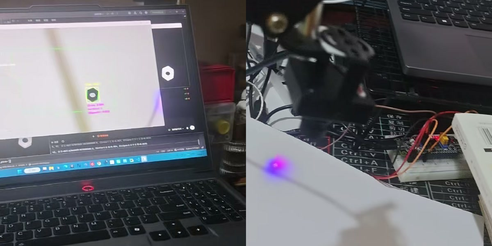
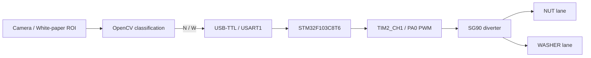

# STM32 视觉分拣系统

这是一个面向 M6 六角螺母与平垫的低成本视觉分拣项目。PC 端使用 Python/OpenCV 识别零件，经 USB-TTL 和 USART1 向 STM32F103C8T6 发送分类结果，再由一个 SG90 舵机完成挡料与左右分流。

> Low-cost vision-based nut and washer sorting prototype using OpenCV, STM32F103C8T6 and a single SG90 servo.

## Demo



[▶ 查看完整分拣演示视频](demo/demo.mp4)

当前原型采用人工逐件上料，视觉判别、串口通信、STM32 控制和物理分流均已完成端到端验证。

## 系统链路

```text
摄像头 → Python/OpenCV → USB-TTL（USART1）
      → STM32F103C8T6 → SG90 → NUT / WASHER 料道
```



## 功能特性

- 白纸 ROI 背景差分与最大连通区域提取；
- 基于外轮廓多边形顶点数区分 M6 螺母和平垫；
- 8 帧稳定等待、10 帧严格多数票和连续空场重新解锁；
- 每个零件最多发送一次 `N/W`，避免摄像头帧率导致重复控制；
- CH340 自动识别，也支持手动指定串口；
- STM32 单字节中断接收与单 SG90 三位置持续保持控制；
- 提供纯视觉安全模式和独立的 PySide6 原理动画。

## 仓库结构

```text
demo/               实机演示视频
docs/               README 预览图等项目资料
visual_pick/        STM32CubeIDE 固件工程与 PC 端识别/串口程序
visual_sort_demo/   辅助 PySide6 原理动画，可使用 Mock 模式独立运行
```

核心成果是 `visual_pick` 中的实机视觉与嵌入式闭环。`visual_sort_demo` 只用于解释数据流和动作流程，不是最终分类算法；它的真实硬件适配器会按相对路径加载 `visual_pick/pc`，因此两个目录应保持在同一个仓库根目录下。

## 硬件配置

| 项目 | 配置 |
|---|---|
| MCU | STM32F103C8T6，LQFP48 |
| 系统时钟 | HSE 8 MHz，PLL ×9，72 MHz |
| 串口 | USART1，PA9/PA10，115200 8N1 |
| 舵机 PWM | TIM2_CH1 / PA0，50 Hz |
| 舵机位置 | NUT 1100 µs，CENTER 1500 µs，WASHER 1900 µs |
| 调试接口 | SWD，PA13/PA14 |

## 视觉算法

最终实机入口为 `visual_pick/pc/visual_sort.py`：

```text
白纸背景差分
→ 阈值 30
→ 3×3 形态学开运算
→ 最大连通区域
→ RETR_EXTERNAL 最大外轮廓
→ approxPolyDP（0.03 × perimeter）
→ 逐帧分类与 10 帧严格多数票
```

| 外轮廓近似顶点数 | 单帧类别 |
|---:|---|
| 5～7 | `NUT` |
| ≥8 | `WASHER` |
| 其它 | `UNKNOWN` |

圆度、面积和椭圆误差保留为诊断信息，不参与最终 NUT/WASHER 决策。

## 程序入口说明

- `visual_pick/pc/visual_sort.py`：最终实机视觉、状态机和串口控制入口；
- `visual_pick/pc/serial_test.py`：舵机回中与三位置串口安全测试；
- `visual_pick/pc/main.py`、`ui_main_window.py`、`detector.py`：早期 PySide6 GUI/实验检测兼容路径，不代表最终分类算法；
- `visual_sort_demo/main.py`：辅助原理动画，默认可在 Mock 模式运行。

## PC 端快速开始

以下命令在仓库根目录执行：

```powershell
python -m venv .venv
.\.venv\Scripts\python.exe -m pip install -r visual_pick\pc\requirements.txt
```

先使用纯视觉模式调试，不连接串口、不驱动舵机：

```powershell
.\.venv\Scripts\python.exe visual_pick\pc\visual_sort.py --vision-only
```

确认供电、共地、机械余量和分类结果后，再连接实际串口：

```powershell
.\.venv\Scripts\python.exe visual_pick\pc\visual_sort.py --port COM3
```

程序也会尝试自动识别 CH340；串口号会随电脑和 USB 端口变化。

## 动画演示

```powershell
.\.venv\Scripts\python.exe -m pip install -r visual_sort_demo\requirements.txt
.\.venv\Scripts\python.exe visual_sort_demo\main.py
```

Mock 模式只需要 PySide6。接入真实识别与串口时，还需要安装 `visual_pick/pc/requirements.txt` 中的依赖。该动画用于解释系统流程，实机程序仍以 `visual_pick/pc/visual_sort.py` 为准。

## STM32 固件

使用 STM32CubeIDE 导入 `visual_pick` 工程，或从 `visual_pick/visual_pick.ioc` 打开并生成工程。当前目标工具链是 STM32CubeIDE/GCC。

固件串口协议的主要命令：

| 命令 | 行为 | 回复 |
|---|---|---|
| `N` / `n` | 转到螺母侧并保持 | `SERVO:NUT` |
| `W` / `w` | 转到平垫侧并保持 | `SERVO:WASHER` |
| `C` / `X` / `x` | 人工回中 | `CENTER` |

## 安全说明

- SG90 使用独立、稳定的 5 V 电源，不得由 STM32 GPIO 或 3.3 V 引脚供电。
- 舵机电源 GND、STM32 GND 和 USB-TTL GND 必须共地。
- USB-TTL 优先使用 3.3 V 逻辑，TX/RX 交叉连接；VCC 默认不接 STM32。
- 首次动作前先使用纯视觉模式，并确认舵机机械余量；实际安装仍需标定三位置。

## 当前状态

完整原型已经完成端到端实测：摄像头识别螺母/平垫，PC 端单次发送 `N/W`，STM32 返回对应应答并驱动 SG90 完成左右物理分流。当前演示采用人工逐件上料；固件已完成 STM32CubeIDE/GCC 构建、CMSIS-DAP 烧录校验和串口闭环测试。

## 已知限制

- 当前为人工逐件上料，不包含自动供料机构；
- 背景差分依赖相对稳定的白纸背景、相机位置和光照；
- 分类规则主要针对本项目实测的 M6 螺母和平垫；
- 机械结构属于低成本概念验证原型，不是工业设备；
- 尚未给出大样本长期准确率、节拍和故障率统计；
- 更换 USB-TTL 模块时仍应实测其 TX 逻辑高电平并确认 3.3 V 兼容。

## 后续方向

- 增加可靠的单件自动上料机构；
- 扩充样本并量化识别准确率、分拣成功率和单件周期；
- 增强对光照变化、反光和零件姿态的鲁棒性；
- 重新设计更紧凑、可重复装配的机械结构。
